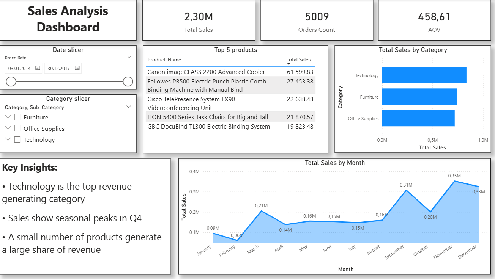

# 📊 Sales Analysis (SQL Server + Power BI)

## 📌 Project Overview

This project was created as part of a **Junior Data Analyst** portfolio.
The goal is to analyze sales data, calculate key business metrics, and visualize insights using Power BI.

The project simulates a real-world analytics workflow: importing data from CSV, cleaning and transforming data in SQL Server, performing analytical queries, and building an interactive BI dashboard.

---

## 🗂 Dataset

* Dataset: **Sample – Superstore**
* Data type: sales, customers, products, regions
* Source: public educational dataset (CSV)

---

## 🛠 Tools & Technologies

* **SQL Server / SSMS** — data import, cleaning, transformations, analytical queries
* **Power BI** — data visualization and interactive dashboard
* **Python (pandas, matplotlib)** — basic exploratory analysis (formal requirement)

---

## 🧩 Project Structure

```
Sales-Analysis-SQL-PowerBI
│
├── SQL
│   ├── 01_create_database.sql
│   ├── 02_data_cleaning.sql
│   └── 03_sales_analysis.sql
│
├── PowerBI
│   └── sales_dashboard.png
│
├── Python
│   └── superstore_analysis.ipynb
│
└── README.md
```

---

## 📈 Key Metrics

The following metrics were calculated:

* **Total Sales** — total revenue
* **Orders Count** — number of unique orders
* **Average Order Value (AOV)**
* Monthly sales trend
* Sales by category and sub-category
* Top 5 products by revenue
* Top 10 cities by sales

---

## 📊 Power BI Dashboard



The dashboard includes:

* KPI cards (Total Sales, Orders Count, AOV)
* Monthly sales trend
* Sales by category and sub-category (drill-down)
* Top products and cities
* Filters by date, region, and category

---

## 🧠 Insights

* Sales show noticeable seasonality
* A small number of categories generate the majority of revenue
* Sales are concentrated in top-performing cities

---

## 👤 Author

Junior Data Analyst

This project was created for educational purposes to demonstrate SQL and Power BI skills.
